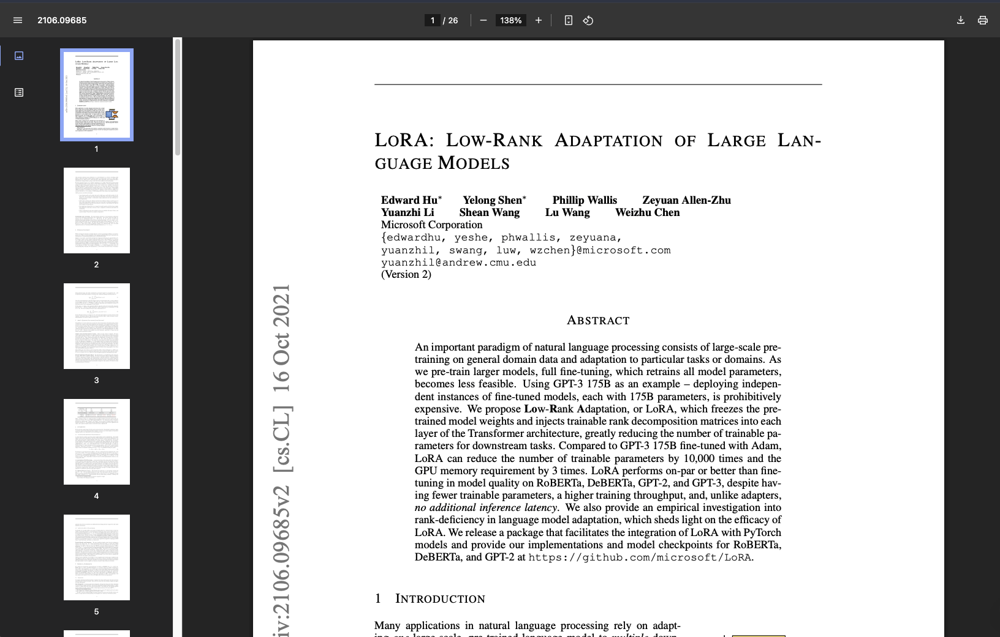

## Day 1: 2025-6-19

**Today's Goal:** Read LoRa paper, watch videos and grasp the key concepts and implementation

**Key Accomplishments:**
* Watched videos on LLM architecture to refresh my knowledge
* Read the LoRa paper
* Watched YT videos on LoRa

**Notes:**
* Today was a good start to the project, and I feel like I built a good base of understanding to start implementing the LoRa method in coding. 

